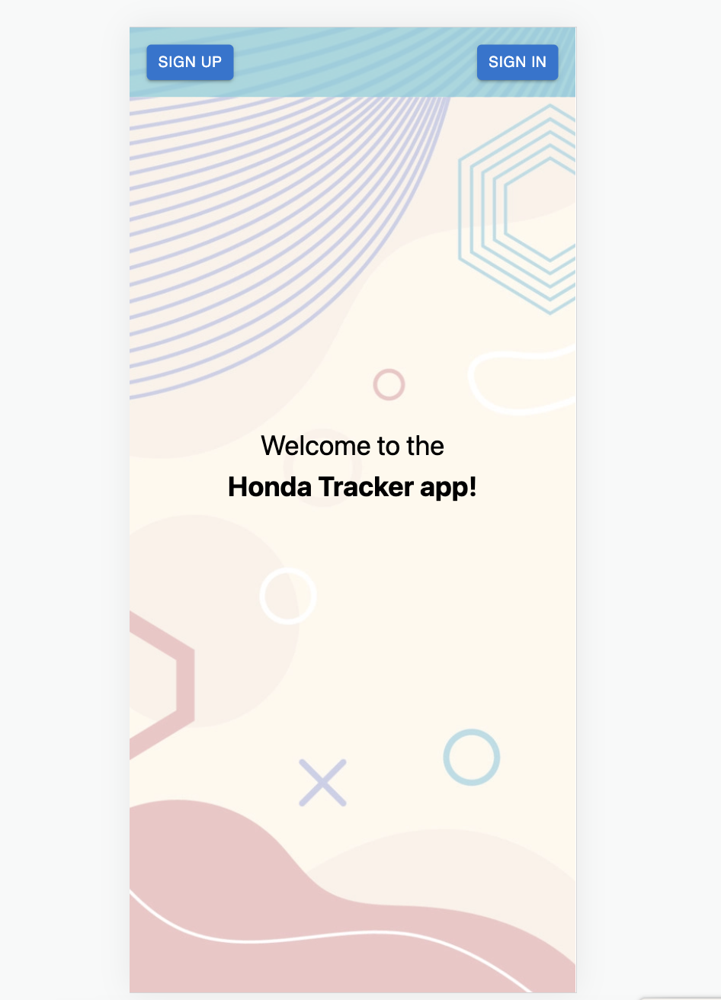
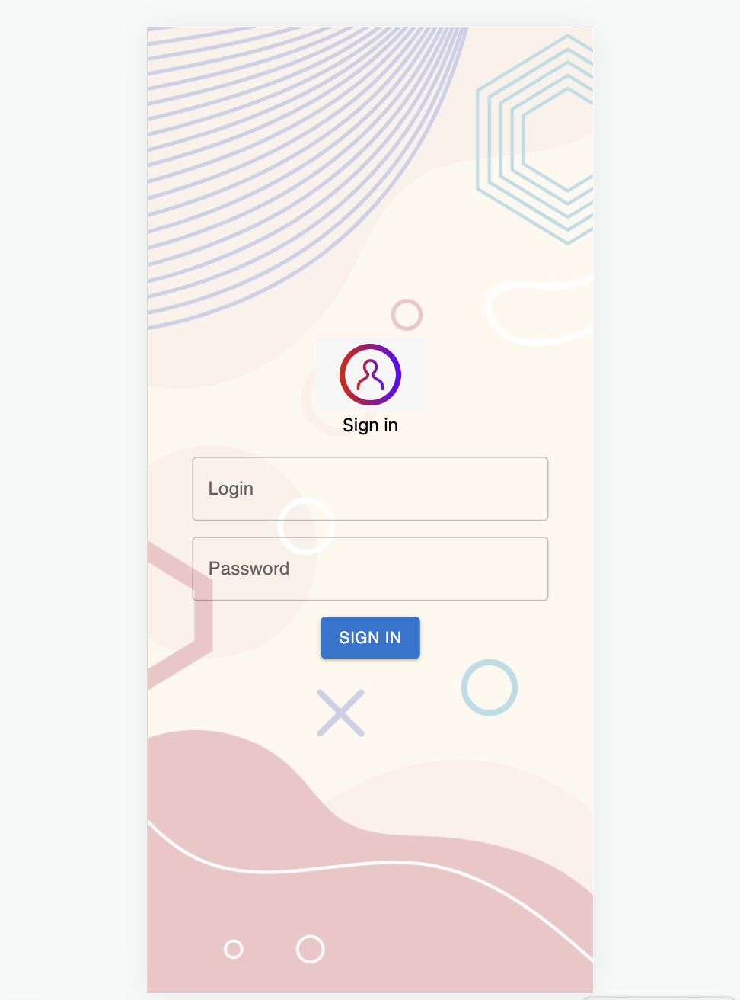
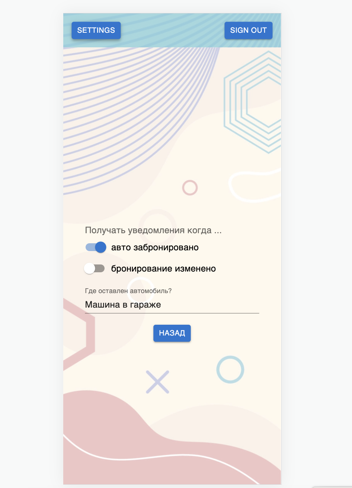
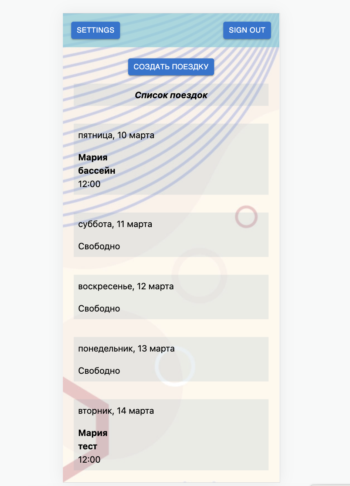
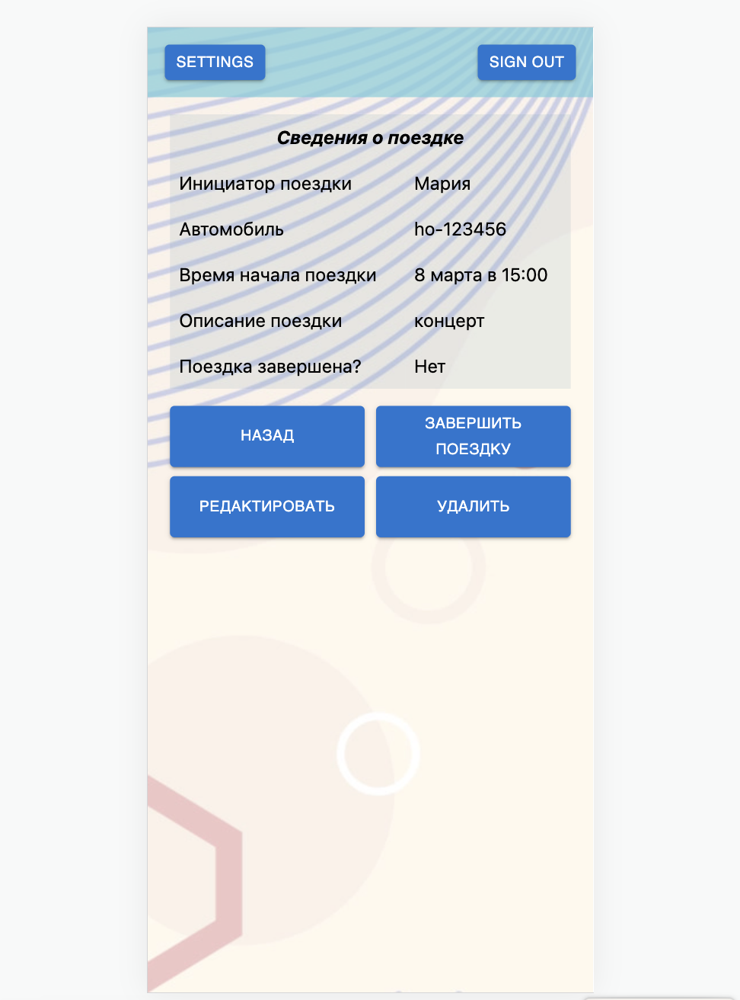

# Honda Tracker - booking app

A demo app for booking a family car.

## Table of contents

* [General info](#general-info)
* [Technologies](#technologies)
* [Setup](#setup)
* [Illustrations](#illustrations)

## General info

A simple app to track the time when users book Honda car. This application can be useful if several people use the same car.

It is a responsive app (mobile and desktop version).
After logging in, the user sees a calendar with booking information. User can create, edit, delete a booking, complete a ride, see a booking details, choose settings. All booking information comes from DynamoDB.

## Technologies

* React
* Typescript
* CSS: Tailwind
* Forms: Formik
* Intl.DateTimeFormat
* RTK query
* Postman client for backend requests

## Setup

To run this project, install it locally using npm:

```
$ cd ../honda-tracker
$ npm install
$ npm start
```

## Illustrations 









